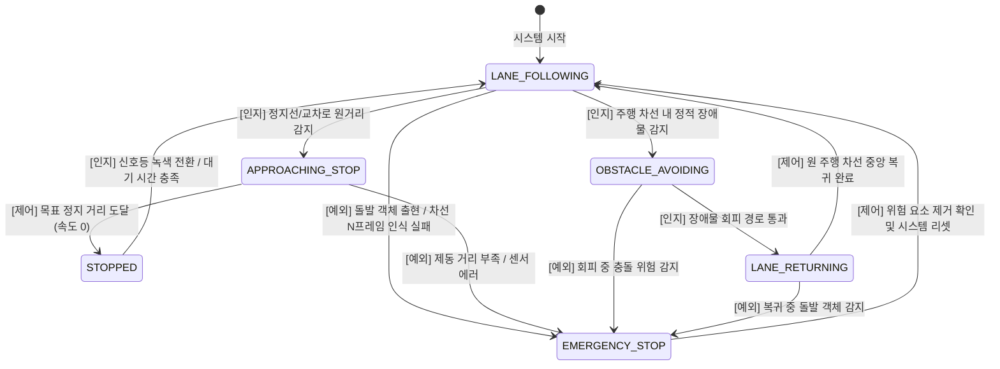

# Planning

주행 상태와 미션을 판단하는 모듈

```mermaid
stateDiagram-v2
    %% 초기 상태
    [*] --> LANE_FOLLOWING : 시스템 시작

    %% 기본 주행 중 상태 전환
    LANE_FOLLOWING --> APPROACHING_STOP : [인지] 정지선/교차로 원거리 감지
    LANE_FOLLOWING --> OBSTACLE_AVOIDING : [인지] 주행 차선 내 정적 장애물 감지
    LANE_FOLLOWING --> EMERGENCY_STOP : [예외] 돌발 객체 출현 / 차선 N프레임 인식 실패

    %% 교차로/정지선 미션
    APPROACHING_STOP --> STOPPED : [제어] 목표 정지 거리 도달 (속도 0)
    STOPPED --> LANE_FOLLOWING : [인지] 신호등 녹색 전환 / 대기 시간 충족
    
    %% 장애물 회피 미션
    OBSTACLE_AVOIDING --> LANE_RETURNING : [인지] 장애물 회피 경로 통과
    LANE_RETURNING --> LANE_FOLLOWING : [제어] 원 주행 차선 중앙 복귀 완료

    %% 예외 상황에서의 긴급 제동
    APPROACHING_STOP --> EMERGENCY_STOP : [예외] 제동 거리 부족 / 센서 에러
    OBSTACLE_AVOIDING --> EMERGENCY_STOP : [예외] 회피 중 충돌 위험 감지
    LANE_RETURNING --> EMERGENCY_STOP : [예외] 복귀 중 돌발 객체 감지

    %% 긴급 정지 후 복구
    EMERGENCY_STOP --> LANE_FOLLOWING : [제어] 위험 요소 제거 확인 및 시스템 리셋
```

## 예정 파일
- fsm.py
- mission.py
- state.py